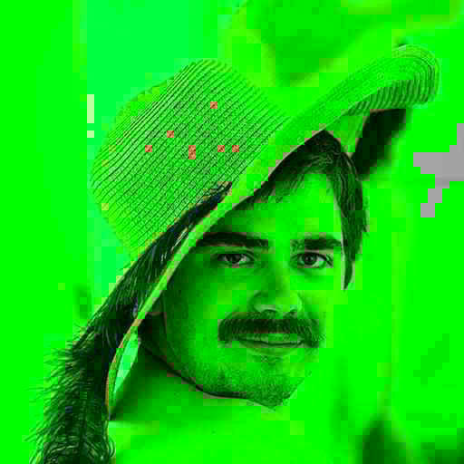

# Generation loss in Rust's image


## Building

```
cargo build 
```

## Example

```
generation_loss cool.png 100 out jpg
```

| Original                    | After 100 generations    |
|-----------------------------|--------------------------|
|  |  |


Image from: https://mortenhannemose.github.io/lena/
```
@misc{hannemoselena,
    author = {Morten Rieger Hannemose},
    title = {Recreated Lena Picture},
    year = {2019},
    url = {https://mortenhannemose.github.io/lena/}
}
```

